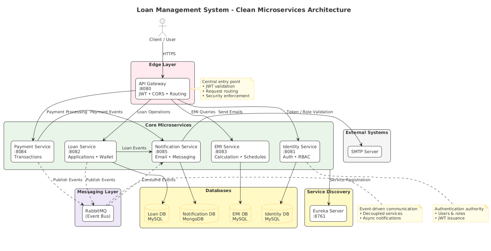
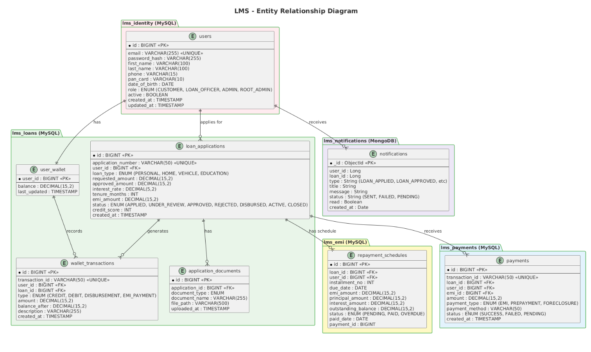
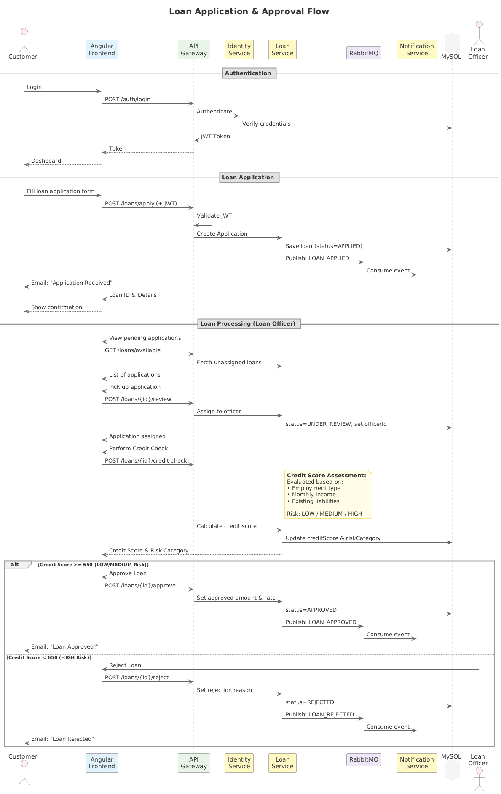

<!-- _class: lead -->
<!-- _backgroundColor: #667eea -->
<!-- _color: white -->

# LOAN MANAGEMENT SYSTEM

### A Secure Full-Stack Microservices Application

**Sravanthi Gurram**
January 2026

---

## Problem Statement

### The Challenge
- Manual, paper-heavy loan processing
- Lack of real-time tracking
- Fragmented systems
- Security vulnerabilities
- Poor customer experience

### Our Solution
A modern, secure, **microservices-based** Loan Management System that automates the complete loan lifecycle.

**Automated | Secure | Scalable**

---

## Key Features

| Feature | Description |
|---------|-------------|
| **Secure Authentication** | JWT-based login with role-based access control |
| **Loan Application** | Apply for various loan types with validation |
| **EMI Calculator** | Real-time EMI calculation and schedule generation |
| **Virtual Wallet** | Simulated disbursement & payment system |
| **Notifications** | Email alerts for all loan status changes |
| **Multi-Role Support** | Customer, Loan Officer, Admin, ROOT_ADMIN |

---

## System Architecture

---

## Architecture Highlights

| Component | Purpose |
|-----------|---------|
| **API Gateway** | Single entry point, JWT validation, routing |
| **Eureka Server** | Service discovery & registration |
| **Config Server** | Centralized configuration from Git |
| **RabbitMQ** | Async event-driven notifications |
| **Polyglot DB** | MySQL for transactions, MongoDB for notifications |

---

## Technology Stack

### Backend
- Spring Boot 3.3
- Spring Cloud (Gateway, Eureka, Config)
- Spring Security + JWT
- Spring Data JPA / MongoDB
- RabbitMQ

### Frontend & DevOps
- Angular 17 + TypeScript
- Docker & Docker Compose
- Jenkins CI/CD
- SonarCloud + JaCoCo
- MySQL 8.0 + MongoDB 6.0

---

## Microservices Overview

| Service | Port | Database | Responsibilities |
|---------|------|----------|-----------------|
| Identity | 8081 | MySQL | Authentication, JWT, RBAC |
| Loan | 8082 | MySQL | Applications, Wallet, Credit Check |
| EMI | 8083 | MySQL | Calculation, Schedule Generation |
| Payment | 8084 | MySQL | Transaction Recording |
| Notification | 8085 | MongoDB | Email Alerts, Event Consumption |

**Infrastructure:** Config Server `:8888` - Eureka `:8761` - Gateway `:8080`

---

## Database Design

---

## Loan Status Flow

---

## Security Implementation

### JWT Authentication
- BCrypt password hashing
- Stateless token-based auth
- Role-based access control

### RBAC Matrix
| Role | Apply | Approve | Create Staff |
|------|-------|---------|--------------|
| Customer | Yes | No | No |
| Loan Officer | No | Yes | No |
| Admin | No | Yes | Yes |

---

## CI/CD Pipeline

### Quality Gates
Coverage > 80% | No Critical Bugs | No Vulnerabilities

---

## Business Rules

| Rule | Implementation |
|------|----------------|
| Credit-Based Loan Limits | Score >=750: Rs.25L, >=700: Rs.15L, >=650: Rs.5L, >=600: Rs.1L |
| Risk-Based Interest Rate | Excellent: 9%, Good: 10%, Fair: 11%, Minimum: 12% |
| EMI-to-Income Ratio | New EMI must be <= 40% of monthly income |
| Debt-to-Income Ratio | Total debt (existing + new) <= 50% of income |
| Withdrawal Allowed | Only when status = APPLIED (before review starts) |
| Approval Requires | Status = UNDER_REVIEW + Credit check completed |

---

## Challenges & Solutions

| Challenge | Solution |
|-----------|----------|
| Partial payment failure (wallet debited, EMI not marked paid) | Implemented eventual consistency with RabbitMQ; compensating transactions for rollback |
| JWT token validation across 5 microservices | Centralized validation at API Gateway; propagated user claims via headers |
| Race condition in loan officer assignment | Added optimistic locking with version field; database-level constraints |
| Email delivery failures blocking main flow | Made notification async via message queue; failures logged, not blocking |

### Key Learnings
Design for failure | Async over sync | Test edge cases early

---

## Future Scope

### Phase 2
- Mobile App (Flutter)
- Payment Gateway (Razorpay)
- Analytics Dashboard

### Phase 3
- AI Credit Scoring
- Cloud Deployment (AWS/Azure)
- Kubernetes Auto-scaling

---

<!-- _class: lead -->
<!-- _backgroundColor: #667eea -->
<!-- _color: white -->

# Thank You!

### Questions?

**Sravanthi Gurram**
github.com/Sravanthi1206
sravanthigurram955@gmail.com
